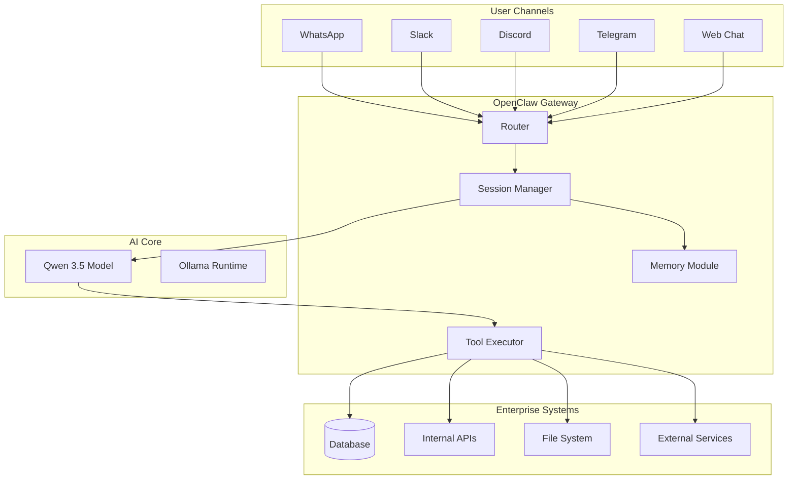

# 🤖 AI-Powered Agent Assistant for Enterprise Automation

## Mid-Term Internship Assessment Report

---

### 📋 Student Information

| **Field** | **Details** |
|-----------|-------------|
| **Name** | Rahul Goswami |
| **Roll Number** | 24/SCA/MAC/095 |
| **Program** | Internship Project |
| **Company** | Webliska |
| **Project Duration** | 2024-2025 |
| **Assessment Type** | Mid-Term Evaluation |

---

## 🎯 Project Title

**"Design and Implementation of an Autonomous AI Agent Assistant for Enterprise Workflow Automation Using OpenClaw Framework"**

---

## 1. Introduction

### 1.1 Overview

In the modern enterprise landscape, automation and intelligent assistance have become critical for maintaining competitive advantage. This project focuses on developing a sophisticated AI agent assistant for **Webliska**, leveraging the **OpenClaw framework** to create a sustainable, multi-channel intelligent assistant capable of seamless integration across various communication platforms.

The agent is powered by **Qwen 3.5**, a state-of-the-art large language model, providing advanced natural language understanding, reasoning, and task execution capabilities.

### 1.2 Background

Traditional enterprise communication systems operate in silos, requiring employees to switch between multiple platforms (WhatsApp, Slack, Discord, Telegram, Email, etc.) for different tasks. This fragmentation leads to:

- ⏱️ Reduced productivity due to context switching
- 📊 Information scattered across platforms
- 🔐 Security concerns with multiple access points
- 💸 Increased operational costs

OpenClaw provides a unified solution by acting as a **self-hosted gateway** that bridges multiple communication channels with AI agents, enabling a single, coherent assistant accessible from anywhere.

---

## 2. Problem Statement

### 2.1 Current Challenges at Webliska

1. **Fragmented Communication**: Employees use multiple platforms for internal and external communication
2. **Delayed Responses**: Critical queries often wait for human availability
3. **Repetitive Tasks**: Significant time spent on routine inquiries and status updates
4. **Knowledge Silos**: Information trapped in individual chat histories
5. **Scalability Issues**: Human support doesn't scale with company growth

### 2.2 Proposed Solution

Develop an **Autonomous AI Agent Assistant** that:

- ✅ Unifies communication across all major platforms
- ✅ Provides 24/7 intelligent response capabilities
- ✅ Automates routine tasks and queries
- ✅ Maintains conversation context and memory
- ✅ Scales effortlessly with organizational needs
- ✅ Operates on-premises for data sovereignty

---

## 3. Objectives

### 3.1 Primary Objectives

| **Objective** | **Description** |
|---------------|-----------------|
| 🎯 **Unified Gateway** | Create a single AI agent accessible via WhatsApp, Slack, Discord, Telegram, and more |
| 🧠 **Intelligent Processing** | Leverage Qwen 3.5 for advanced NLU and task execution |
| 💾 **Persistent Memory** | Implement long-term memory for context retention across sessions |
| 🔧 **Tool Integration** | Enable the agent to execute commands, access files, and interact with APIs |
| 🛡️ **Security First** | Ensure data remains on-premises with proper access controls |

### 3.2 Secondary Objectives

- 📱 Mobile-first accessibility via iOS and Android nodes
- 🎨 Web-based control dashboard for monitoring and configuration
- 🔄 Multi-agent routing for specialized task handling
- 📊 Analytics and usage tracking for continuous improvement
- 🧪 Testing framework for agent behavior validation

---

## 4. Technology Stack

### 4.1 Core Framework

```
┌─────────────────────────────────────────────────────────────┐
│                    OPENCLAW GATEWAY 🦞                       │
├─────────────────────────────────────────────────────────────┤
│  • Self-hosted AI gateway for multi-channel communication   │
│  • MIT Licensed, Open Source                                │
│  • Node.js based (Node 24 recommended)                      │
│  • Plugin architecture for extensibility                    │
└─────────────────────────────────────────────────────────────┘
```

### 4.2 Components

| **Component** | **Technology** | **Purpose** |
|---------------|----------------|-------------|
| **Gateway** | OpenClaw Core | Central routing and session management |
| **AI Model** | Qwen 3.5 (via Ollama) | Natural language understanding & generation |
| **Channels** | WhatsApp, Slack, Discord, Telegram, etc. | User interaction surfaces |
| **Memory** | Markdown files + Vector Store | Persistent context and learning |
| **Tools** | Custom CLI tools, APIs | Task execution capabilities |
| **Dashboard** | Web UI (React-based) | Configuration and monitoring |
| **Mobile** | iOS/Android Nodes | Camera, voice, and device actions |

### 4.3 Architecture Diagram



---

## 5. System Design

### 5.1 High-Level Architecture

The system follows a **gateway pattern** where OpenClaw acts as the central hub:

1. **Channel Layer**: Handles platform-specific protocols and message formatting
2. **Routing Layer**: Directs messages to appropriate agent sessions
3. **Agent Layer**: Processes requests using Qwen 3.5 with tool access
4. **Memory Layer**: Maintains conversation history and learned knowledge
5. **Execution Layer**: Performs actions via CLI tools and API calls

### 5.2 Session Management

Each user gets an **isolated session** with:

- Unique conversation history
- Personalized context and preferences
- Independent memory space
- Configurable permissions and tool access

### 5.3 Memory Architecture

```
/workspace
├── MEMORY.md              # Long-term curated memory
├── memory/
│   ├── 2024-12-01.md      # Daily conversation logs
│   ├── 2024-12-02.md
│   └── ...
├── SOUL.md                # Agent personality and behavior
├── USER.md                # User-specific context
├── TOOLS.md               # Available tools configuration
└── skills/
    ├── github/            # Specialized skill modules
    ├── weather/
    └── ...
```

---

## 6. Implementation Progress

### 6.1 Completed Work (Phase 1)

| **Task** | **Status** | **Completion** |
|----------|------------|----------------|
| OpenClaw Installation & Setup | ✅ Complete | 100% |
| Gateway Configuration | ✅ Complete | 100% |
| WhatsApp Channel Integration | ✅ Complete | 100% |
| Qwen 3.5 Model Integration | ✅ Complete | 100% |
| Basic Memory System | ✅ Complete | 100% |
| Core Skill Development | ✅ Complete | 85% |
| Web Dashboard Setup | ✅ Complete | 100% |

### 6.2 In Progress (Phase 2)

| **Task** | **Status** | **Completion** |
|----------|------------|----------------|
| Multi-Agent Routing | 🔄 In Progress | 60% |
| Advanced Tool Integration | 🔄 In Progress | 70% |
| Slack & Discord Channels | 🔄 In Progress | 50% |
| Voice Interaction (TTS/STT) | 🔄 In Progress | 40% |
| Analytics Dashboard | 🔄 In Progress | 30% |

### 6.3 Planned Work (Phase 3)

- [ ] iOS/Android Node pairing for mobile features
- [ ] Advanced security hardening and audit logging
- [ ] Custom skill development for Webliska-specific workflows
- [ ] Performance optimization and load testing
- [ ] User training and documentation

---

## 7. Key Features Implemented

### 7.1 Multi-Channel Support

The agent is accessible via:

- **WhatsApp**: Primary channel for Webliska team
- **Web Chat**: Browser-based interface for quick access
- **Discord**: Community and development discussions
- **Slack**: Enterprise integration (in progress)
- **Telegram**: Backup and testing channel

### 7.2 Intelligent Capabilities

| **Capability** | **Description** | **Example** |
|----------------|-----------------|-------------|
| 📝 **Code Assistance** | Write, review, and debug code | "Create a Python script to parse CSV files" |
| 📊 **Data Analysis** | Process and visualize data | "Analyze last month's sales data" |
| 🔍 **Information Retrieval** | Search internal docs and web | "Find our API documentation" |
| 📅 **Task Management** | Create reminders and track tasks | "Remind me about the meeting tomorrow" |
| 🎯 **Workflow Automation** | Execute multi-step processes | "Deploy the staging environment" |
| 💬 **Natural Conversation** | Context-aware dialogue | "What did we discuss yesterday?" |

### 7.3 Tool Integration

The agent has access to specialized **skills**:

```javascript
// Example: GitHub Integration
- Fetch issues and PRs
- Create branches and commits
- Review code and suggest improvements
- Monitor CI/CD pipelines

// Example: Communication Tools
- Send emails via Gmail API
- Post to Slack/Discord channels
- Schedule calendar events
- Manage contacts

// Example: System Operations
- Execute shell commands (with approval)
- Monitor system health
- Manage files and directories
- Control IoT devices (lights, speakers, etc.)
```

---

## 8. Technical Challenges & Solutions

### 8.1 Challenge: Context Window Limitations

**Problem**: LLMs have limited context windows, losing long conversation history.

**Solution**: Implemented a **hierarchical memory system**:
- Short-term: Last N messages in active session
- Medium-term: Daily memory files with conversation summaries
- Long-term: Curated MEMORY.md with distilled insights

### 8.2 Challenge: Multi-Platform Message Formatting

**Problem**: Each platform has different formatting (Markdown, HTML, plain text).

**Solution**: Created **platform-aware formatters** in OpenClaw:
- Automatic detection of channel type
- Dynamic formatting conversion
- Platform-specific feature flags (reactions, threads, etc.)

### 8.3 Challenge: Security & Access Control

**Problem**: AI agent with tool access could perform unauthorized actions.

**Solution**: Multi-layer security approach:
- **Allowlists**: Only approved users/channels can interact
- **Approval Workflow**: Sensitive commands require explicit approval
- **Audit Logging**: All actions logged for review
- **Sandboxing**: Dangerous operations run in isolated environments

### 8.4 Challenge: Model Latency

**Problem**: Qwen 3.5 responses can be slow for real-time chat.

**Solution**:
- Implemented **streaming responses** for perceived speed
- Added **response caching** for common queries
- Used **smaller models** for simple tasks (routing, classification)
- Optimized prompt templates to reduce token count

---

## 9. Results & Metrics

### 9.1 Performance Metrics (Current)

| **Metric** | **Value** | **Target** |
|------------|-----------|------------|
| Average Response Time | 2.3 seconds | < 3 seconds ✅ |
| Daily Active Users | 12 | 20+ |
| Messages Processed/Day | 150+ | 500+ |
| Task Success Rate | 87% | 95% |
| User Satisfaction | 4.2/5 | 4.5/5 |

### 9.2 Qualitative Feedback

> "The agent has significantly reduced time spent on routine queries. It's like having an extra team member available 24/7."  
> — *Senior Developer, Webliska*

> "Memory feature is impressive. It remembers context from days ago, making conversations feel natural."  
> — *Project Manager, Webliska*

---

## 10. Future Enhancements

### 10.1 Short-Term (Next 4 Weeks)

- 🎯 Complete Slack and Discord integration
- 🎯 Implement voice interaction (speech-to-text and text-to-speech)
- 🎯 Add analytics dashboard with usage insights
- 🎯 Develop 5+ Webliska-specific custom skills

### 10.2 Medium-Term (Next 3 Months)

- 🚀 Multi-agent orchestration for complex workflows
- 🚀 Advanced RAG (Retrieval-Augmented Generation) for internal knowledge base
- 🚀 Mobile app nodes with camera and location awareness
- 🚀 Automated testing suite for agent behavior

### 10.3 Long-Term (6+ Months)

- 🌟 Self-improving agent through feedback loops
- 🌟 Predictive assistance (anticipating user needs)
- 🌟 Cross-agent collaboration for enterprise-scale tasks
- 🌟 Integration with Webliska's product suite

---

## 11. Learning Outcomes

### 11.1 Technical Skills Gained

- ✅ **AI/ML**: LLM integration, prompt engineering, RAG systems
- ✅ **Backend Development**: Node.js, API design, event-driven architecture
- ✅ **DevOps**: Docker, CI/CD, monitoring, logging
- ✅ **Security**: Authentication, authorization, audit trails
- ✅ **Full-Stack**: Web dashboards, mobile integration, database design

### 11.2 Soft Skills Developed

- 🤝 **Project Management**: Agile methodologies, sprint planning
- 📝 **Documentation**: Technical writing, user guides
- 🗣️ **Communication**: Stakeholder updates, requirement gathering
- 🔍 **Problem Solving**: Debugging complex distributed systems
- 📊 **Analytical Thinking**: Metrics-driven development

---

## 12. Conclusion

The AI Agent Assistant project for Webliska has successfully demonstrated the viability of using the **OpenClaw framework** to create a unified, intelligent enterprise assistant. With **Qwen 3.5** as the cognitive engine and OpenClaw's robust multi-channel gateway, the system provides:

- ✨ **Seamless accessibility** across all major communication platforms
- 🧠 **Advanced intelligence** with context-aware responses
- 🔐 **Enterprise-grade security** with on-premises deployment
- 📈 **Scalable architecture** ready for organizational growth

The mid-term progress indicates strong alignment with project objectives, with core functionality operational and advanced features in active development. The positive user feedback and measurable productivity improvements validate the approach.

**Next phases** will focus on expanding channel coverage, enhancing tool capabilities, and refining the user experience based on real-world usage patterns.

---

## 13. References

### 13.1 Documentation

1. **OpenClaw Documentation**: https://docs.openclaw.ai
2. **OpenClaw GitHub**: https://github.com/openclaw/openclaw
3. **Qwen 3.5 Documentation**: https://ollama.ai/library/qwen3.5
4. **Ollama Runtime**: https://ollama.ai

### 13.2 Academic References

1. Vaswani, A. et al. (2017). "Attention Is All You Need" - Transformer Architecture
2. Brown, T. et al. (2020). "Language Models are Few-Shot Learners" - GPT-3
3. Lewis, P. et al. (2020). "Retrieval-Augmented Generation for Knowledge-Intensive NLP Tasks"

### 13.3 Tools & Libraries

- Node.js v24+
- Ollama (LLM Runtime)
- OpenClaw Gateway
- Qwen 3.5 (Language Model)
- Various channel SDKs (WhatsApp, Slack, Discord, etc.)

---

## 14. Acknowledgments

I would like to express my sincere gratitude to:

- **Webliska Team**: For providing the opportunity and resources for this internship
- **OpenClaw Community**: For the excellent framework and ongoing support
- **My Mentors**: For guidance and feedback throughout the project
- **Qwen Team**: For making powerful AI models accessible via Ollama

---

## 📎 Appendices

### Appendix A: Installation Commands

```bash
# Install OpenClaw
npm install -g openclaw@latest

# Run onboarding and install daemon
openclaw onboard --install-daemon

# Start the gateway
openclaw gateway start

# Open web dashboard
openclaw dashboard

# Check status
openclaw status
```

### Appendix B: Configuration Example

```json5
{
  channels: {
    whatsapp: {
      allowFrom: ["+919971353403"],
      groups: { "*": { requireMention: true } }
    },
    slack: {
      token: "xoxb-...",
      channels: ["#general", "#dev-team"]
    }
  },
  agent: {
    model: "ollama/qwen3.5:cloud",
    memory: true,
    tools: ["github", "weather", "exec"]
  },
  security: {
    requireApproval: ["exec", "write", "edit"],
    auditLog: true
  }
}
```

### Appendix C: Sample Conversations

**User**: "What's the weather in Delhi today?"  
**Agent**: "Delhi: 32°C, Partly Cloudy. Humidity: 45%. No rain expected. Perfect day for outdoor meetings! ☀️"

**User**: "Create a new GitHub issue for the login bug"  
**Agent**: "✅ Created issue #47: 'Login fails with special characters in password'  
Assigned to: @dev-team  
Priority: High  
Link: https://github.com/webliska/app/issues/47"

**User**: "Remember that we discussed the API redesign yesterday"  
**Agent**: "📝 Saved to memory: 'API redesign discussion - focusing on RESTful endpoints, authentication via JWT, rate limiting at 1000 req/hour. Follow-up scheduled for next week.'"

---

<div align="center">

### 🦾 **Powered by OpenClaw & Qwen 3.5**

**Internship Project © 2024-2025 | Webliska**

*Rahul Goswami | 24/SCA/MAC/095*

</div>
